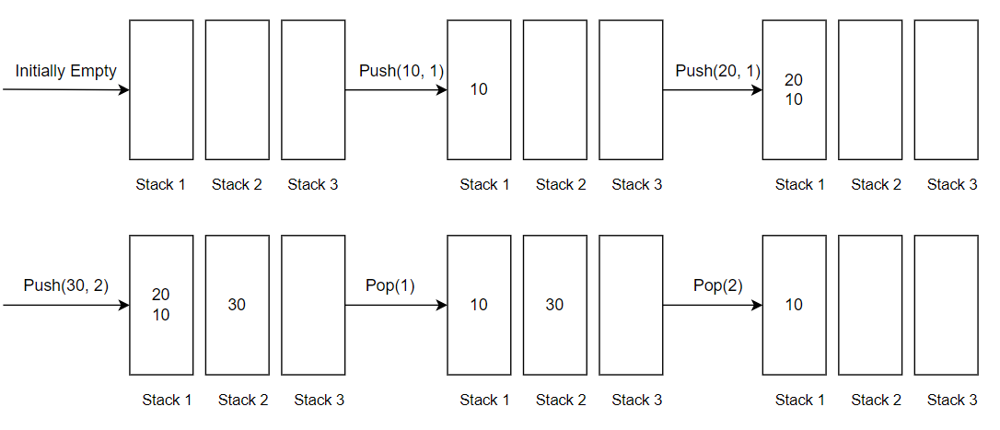

# N Stacks In An Array

Create a data structure nStacks that represents n stacks. 
Implementation of nStacks should use only one array, i.e., n stacks should use the same array for storing elements.

The following functions must be supported by n Stacks- 
- push(int x, int sn) –> pushes x to stack number ‘sn’ where sn is from 0 to n-1  
- pop(int sn) -> pops an element from stack number ‘sn’ where sn is from 0 to n-1 


[]()
### Example 1
```sh
Input :
N = 3
S = 6
push(10, 1)
push(20, 1)
push(30, 2)
pop(1)
pop(2)

Output :
True 
True
True
20
30
Explanation :
Operations performed on the stack are as follows:
push(10, 1): Push element ‘10’ into the 1st stack. This returns true.
push(20, 1): Push element ‘20’ into the 1st stack. This returns true.
push(30, 2): Push element ‘30’ into the 2nd stack. This returns true.
pop(1): Pop the top element from the 1st stack. This returns 20.
pop(2): Pop the top element from the 2nd stack. This returns 30.

The image shows the snapshots of the stack after each operation:
```