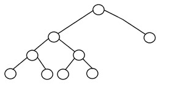
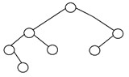

# Tree

- **Node**: It represents a termination point in a tree.
- **Root**: A tree’s topmost node. 
- **Parent**: Each node (apart from the root) in a tree that has at least one sub-node of its own is called a parent node.
- **Child**: A node that straightway came from a parent node when moving away from the root is the child node.
- **Leaf Node**: These are external nodes. They are the nodes that have no child.
- **Internal Node**: As the name suggests, these are inner nodes with at least one child.
- **Depth**: The number of edges from the tree’s node to the root is.
- **Height**: It is the number of edges from the node to the deepest leaf. The tree height is also considered the root height. The Height of binary tree with single node is taken as zero. Maximum height of the binary tree is n-1 and minimum height is floor(log2n).
- **Size**: The size of a tree is the number of nodes. The maximum number of nodes at level 'l' of a binary tree is 2l. Here level is the number of nodes on the path from the root to the node (including root and node). Level of the root is 0.
- **Full Binary Tree**: A Binary Tree is a full binary tree if every node has 0 or 2 children.

    
- **Complete Binary Tree**: A complete binary tree is another specific type of binary tree where all the tree levels are filled entirely with nodes, except the lowest level of the tree. Also, in the last or the lowest level of this binary tree, every node should possibly reside on the left side.

     
- **Perfect Binary Tree**: A binary tree is said to be ‘perfect’ if all the internal nodes have strictly two children, and every external or leaf node is at the same level or same depth within a tree. A perfect binary tree having height ‘h’ has 2h – 1 node.  

     
- **Balanced Binary Tree**: A binary tree is said to be ‘balanced’ if the tree height is O(logN), where ‘N’ is the number of nodes. In a balanced binary tree, the height of the left and the right subtrees of each node should vary by at most one. An AVL Tree and a Red-Black Tree are some common examples of data structure that can generate a balanced binary search tree.

    
- **Degenerate Binary Tree**: A binary tree is said to be a degenerate binary tree or pathological binary tree if every internal node has only a single child. Such trees are similar to a linked list performance-wise.

    
