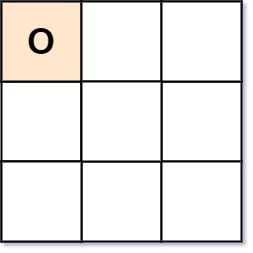

# Valid Tic-Tac-Toe State

Given a Tic-Tac-Toe board as a string array board, return true if and only if it is possible to reach this board position during the course of a valid tic-tac-toe game.

The board is a 3 x 3 array that consists of characters ' ', 'X', and 'O'. The ' ' character represents an empty square.

Here are the rules of Tic-Tac-Toe:

- Players take turns placing characters into empty squares ' '.
- The first player always places 'X' characters, while the second player always places 'O' characters.
- 'X' and 'O' characters are always placed into empty squares, never filled ones.
- The game ends when there are three of the same (non-empty) character filling any row, column, or diagonal.
- The game also ends if all squares are non-empty.
- No more moves can be played if the game is over.

[]()
### Example 1
```sh
Input: board = ["O  ","   ","   "]
Output: false
Explanation: The first player always plays "X".
```

[]()
### Example 2
```sh
Input: board = ["XOX"," X ","   "]
Output: false
Explanation: Players take turns making moves.
```

[]()
### Example 3
```sh
Input: board = ["XXX","   ","OOO"]
Output: false
```

[]()
### Example 4
```sh
Input: board = ["XOX","O O","XOX"]
Output: true
```

### Constraints
```sh
board.length == 3
board[i].length == 3
board[i][j] is either 'X', 'O', or ' '.
```
